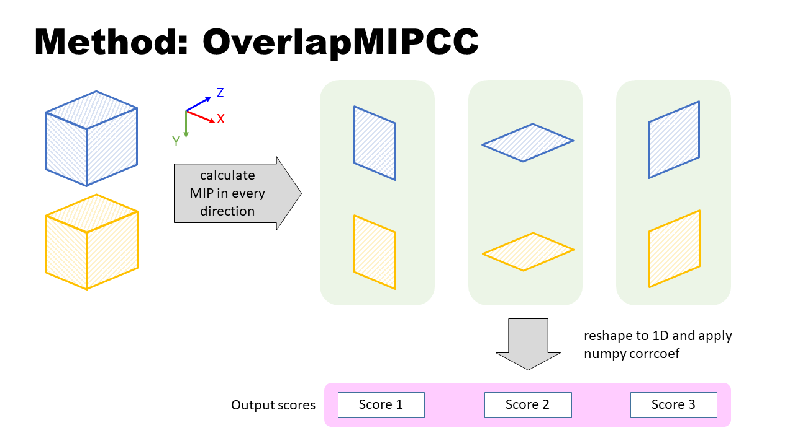

# Overlap-Correlation
This is a python script to calculate the correlation coefficient of the overlap area of two given arrays with own anchor position. It can be applied to 2D, 3D or even arrays with higher dimensions.

## How to use
You can easily import the script `OverlapCorrelation.py` as a module by key in
> `import OverlapCorrelation` 
 
or just copy-paste the content of `OverlapCorrelation.py` into your own python script.

## Class, attribute and method
Take two 3D arrays (image A and image B) as an example. Assume that we wanted to calculate the correlation coefficient score between two overlap area from image A and B.

### class

`OverlapCorrelation.OverlapCorr(mx_1, mx_2, position_1, position_2)`
| argument | type | in example |
| - | - | - |
| mx_1 | numpy array | Image A |
| mx_2 | numpy array | Image B |
| position_1 | tuple, list, or numpy array | anchor point of Image A |
| position_2 | tuple, list, or numpy array | anchor point of Image B |

### attribute
| attribute | returns |
| - | - |
| mx_1 | mx_1|
| mx_2 | mx_2|
| position_1 | position_1 |
| position_2 | position_2 |
| position_diff | difference between position_2 and position_1 |
| shape_mx_1| shape of mx_1 |
| shape_mx_2| shape of mx_2 |
| overlap_mx_1| Overlap area of mx_1 |
| overlap_mx_2| Overlap area of mx_2 |
| shape_overlap_mx_1| Shape of overlap area of mx_1 |
| shape_overlap_mx_2| Shape of overlap area of mx_2 |

### method

`OverlapCorrelation.OverlapCorrcoef.OverlapCC(ifnan=np.nan)`

Reshape the whole overlap area into 1D array and calculate the correlation coefficient score.

| argument | type | description |
| - | - | - |
| ifnan | scalar | If the correlation score is NaN, replace NaN with input value |

Returns: correlation coefficient score of overlap area.

`OverlapCorrelation.OverlapCorrcoef.OverlapMIPCC(ifnan=np.nan)`

Do MIP (maximum intensity projection) along every axis and reshape all the MIP result in to 1D array, calculate the correlation coefficient score.

| argument | type | description |
| - | - | - |
| ifnan | scalar | If the correlation score is NaN, replace NaN with input value |
| merge | boolean | If False, returns 3 individual score. If True, returns mean value of scores.|

Returns: correlation coefficient score of every MIP (3 individual score / mean value).

